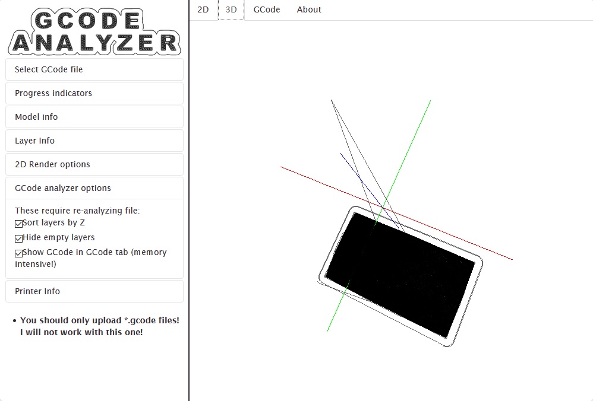
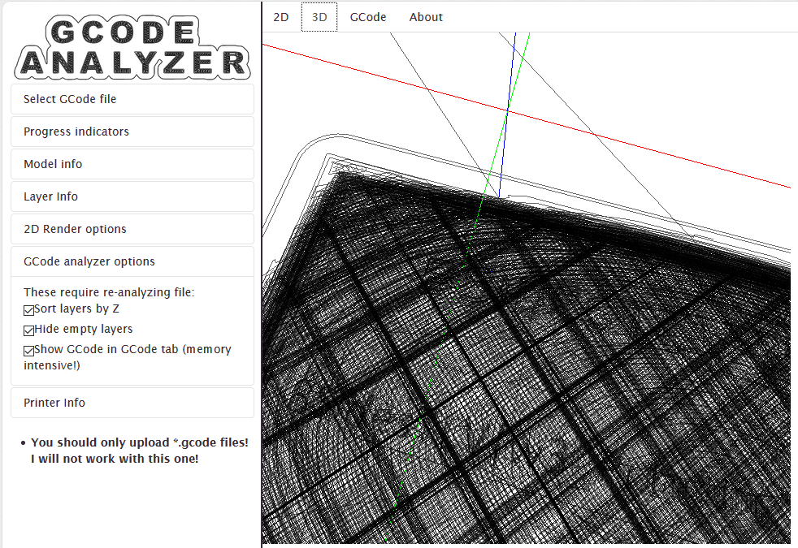

# The Lost Award
* Category: Forensics
* 1000 Points
* Solved by the JCTF Team

## Description
> Commander Keen and B.J. Blazkowicz are trying to bring back some lost award plate. any chance you can help?

A PCAP file was attached.

## Solution

The attached file contains a network capture which mainly involves SMB traffic.

The most interesting part of the capture is writing a file called `BSidesTLV.manipulated_smb.pcapng` in several chunks.
```
root@kali:/media/sf_CTFs/bsidestlv/The_Lost_Award# tshark -r BSidesTLV.gnpacp -Y "smb2.fid == 00000051-0012-0000-1900-100012000000"
Running as user "root" and group "root". This could be dangerous.
  677 167.553239 192.168.40.136 → 192.168.40.128 SMB2 410 Create Response File: BSidesTLV.manipulated_smb.pcapng 445 54774
  678 167.553490 192.168.40.128 → 192.168.40.136 SMB2 275 GetInfo Request FS_INFO/FileFsVolumeInformation;GetInfo Request FS_INFO/FileFsAttributeInformation 54775 445
  680 167.553964 192.168.40.128 → 192.168.40.136 SMB2 162 SetInfo Request FILE_INFO/SMB2_FILE_ENDOFFILE_INFO 54772 445
  682 167.560342 192.168.40.128 → 192.168.40.136 SMB2 42394 Write Request Len:1048576 Off:0 54773 445
  685 167.561693 192.168.40.128 → 192.168.40.136 SMB2 32174 Write Request Len:1048576 Off:1048576 File: BSidesTLV.manipulated_smb.pcapng 54774 445
  698 167.563265 192.168.40.128 → 192.168.40.136 SMB2 64294 Write Request Len:1048576 Off:2097152 54775 445
  785 167.570189 192.168.40.128 → 192.168.40.136 SMB2 64294 Write Request Len:1048576 Off:3145728 54772 445
  844 167.576202 192.168.40.128 → 192.168.40.136 SMB2 64294 Write Request Len:1048576 Off:4194304 54773 445
  872 167.579587 192.168.40.128 → 192.168.40.136 SMB2 64294 Write Request Len:1048576 Off:5242880 54775 445
  926 167.585900 192.168.40.128 → 192.168.40.136 SMB2 64294 [TCP Previous segment not captured] Write Request Len:1048576 Off:7340032 54772 445
 2587 167.639274 192.168.40.128 → 192.168.40.136 SMB2 64294 Write Request Len:1048576 Off:8388608 54773 445
 2631 167.642559 192.168.40.128 → 192.168.40.136 SMB2 64294 Write Request Len:1048576 Off:9437184 54772 445
 2660 167.646622 192.168.40.128 → 192.168.40.136 SMB2 64294 Write Request Len:1048576 Off:10485760 File: BSidesTLV.manipulated_smb.pcapng 54774 445
 2695 167.649439 192.168.40.128 → 192.168.40.136 SMB2 64294 Write Request Len:1048576 Off:11534336 54773 445
 2722 167.651819 192.168.40.128 → 192.168.40.136 SMB2 64294 Write Request Len:713512 Off:12582912 54775 445
 2812 167.662402 192.168.40.128 → 192.168.40.136 SMB2 194 SetInfo Request FILE_INFO/SMB2_FILE_BASIC_INFO File: BSidesTLV.manipulated_smb.pcapng 54774 445
 2814 167.667011 192.168.40.128 → 192.168.40.136 SMB2 162 GetInfo Request FILE_INFO/SMB2_FILE_NETWORK_OPEN_INFO 54775 445
 2816 167.673956 192.168.40.128 → 192.168.40.136 SMB2 146 Close Request 54772 445
```

However, not all of the chunks were available (some TCP packets weren't captured), and the full file could not be reconstructed from the current data.

From what was available, it was apparent that the new file was a PCAP file as well, and perhaps it contained another PCAP file and so on. 
Deep down, base64 encoded data was being transferred. For example, the tail of one of the chunks:
```console
root@kali:/media/sf_CTFs/bsidestlv/The_Lost_Award# tshark -nr  BSidesTLV.gnpacp  -Y 'frame.number==785' -x | tail
Running as user "root" and group "root". This could be dangerous.
faa0  6b 4a 55 52 30 31 61 56 45 39 4e 4d 6b 5a 48 53   kJUR01aVE9NMkZHS
fab0  54 4e 55 52 30 39 43 56 45 68 46 4d 6c 52 42 54   TNUR09CVEhFMlRBT
fac0  56 4a 59 52 30 31 61 52 45 64 50 53 6c 52 4a 56   VJYR01aREdPSlRJV
fad0  56 70 45 54 55 31 61 57 6b 64 4e 4e 45 52 4c 54   VpETU1aWkdNNERLT
fae0  55 4a 54 52 30 46 61 56 45 46 4e 57 6c 5a 48 54   UJTR0FaVEFNWlZHT
faf0  56 6c 55 52 30 35 53 56 55 64 42 57 6b 52 44 54   VlUR05SVUdBWkRDT
fb00  56 70 59 52 31 45 39 50 54 30 39 50 54 30 3d 0a   VpYR1E9PT09PT0=.
fb10  53 55 56 5a 52 55 6c 4e 51 6c 70 48 54 54 52 45   SUVZRUlNQlpHTTRE
fb20  52 30 39 43 56 45                                 R09CVE
```

Let's take a base64 string and start working on it.

We start with:
```
SUVZRUlNQldHTVpUR09KVEdNWlRLTTJGR0lZVEdOSlRHUVpUR01aVkdRWURFTlJUR0FaVEFNMkZHSTRER09CVEhFMlRBTVJZR000VEdSSlNHQVpUT01aWUdVWURFTUpURzQyQT09PT0=
```

Decode it:
```console
root@kali:/media/sf_CTFs/bsidestlv/The_Lost_Award# echo SUVZRUlNQldHTVpUR09KVEdNWlRLTTJGR0lZVEdOSlRHUVpUR01aVkdRWURFTlJUR0FaVEFNMkZHSTRER09CVEhFMlRBTVJZR000VEdSSlNHQVpUT01aWUdVWURFTUpURzQyQT09PT0= | base64 -d
IEYEIMBWGMZTGOJTGMZTKM2FGIYTGNJTGQZTGMZVGQYDENRTGAZTAM2FGI4DGOBTHE2TAMRYGM4TGRJSGAZTOMZYGUYDEMJTG42A====
```

This is base32 (all uppercase letters, and equal signs at the end).
Decode that:
```console
root@kali:/media/sf_CTFs/bsidestlv/The_Lost_Award# echo IEYEIMBWGMZTGOJTGMZTKM2FGIYTGNJTGQZTGMZVGQYDENRTGAZTAM2FGI4DGOBTHE2TAMRYGM4TGRJSGAZTOMZYGUYDEMJTG42A==== | base32 -d
A0D06333933353E2135343335402630303E2838395028393E2037385021374
```

This looks like a hex stream. What is the meaning?
```console
root@kali:/media/sf_CTFs/bsidestlv/The_Lost_Award# echo A0D06333933353E2135343335402630303E2838395028393E2037385021374 | xxd -p -r | xxd -g 1
00000000: a0 d0 63 33 93 33 53 e2 13 53 43 33 54 02 63 03  ..c3.3S..SC3T.c.
00000010: 03 e2 83 83 95 02 83 93 e2 03 73 85 02 13 74     ..........s...t
```

Doesn't look good. 

This is the time to mention that most if not all base64 strings had a common prefix:
```console
root@kali:/media/sf_CTFs/bsidestlv/The_Lost_Award# strings BSidesTLV.gnpacp | grep "==" | head
lNHQVpUT05BPQ==
SUVZRUlNQlRHTVlER1JKU0dVWlRHTVpSR000VEtNQlNIQVpUQU1aWUdOQ1RFTVJUR1FaVENNWllHVVlERU1CVEdBWlRBTVpaR00zRElNQlNHQVpUT05BPQ==
SUVZRUlNQlJHTTRER1JKU0dVWlRHTVpSR000VEtNQlNHWVpUT00yRkdJWURHTkJUR0VaVFFOSlFHSVlER01CVEdBWlRTTVpXR1FZREVNQlRHNDJBPT09PQ==
SUVZRUlNQlZHTTNER05CVEdNWlRBTTJGR0lZVEdNQlRIQVpUS05CUUdJNFRHTlJUR1laVUtNUlJHTVpUR01KVEhFMlRBTVJWR000REdPQlRJVVpETU1aVUdNWVRHT0JWR0FaRENNWlhHUT09PT09PQ==
SUVZRUlNQlNHTTNER01CVEdJWlRDTTJGR0lZVEdNQlRIQVpUS05CUUdJWlRHTkpUR1laVUtNUlFHTVpUR01KVEhFMlRBTVJXR000REdOUlRJVVpEUU1aVUdNWVRHT0JWR0FaRENNWlhHUT09PT09PQ==
SUVZRUlNQlNHTTJUR05SVEc0WlRFTTJGR0lZVEdNQlRIQVpUS05CUUdJNFRHTVJUR1VaVUtNUllHTVpER01KVEhFMlRBTVJWR00zVEdOWlRJVVpEQ01aVkdNWVRHT0JWR0FaRENNWlhHUT09PT09PQ==
SUVZRUlNQlhHTVlER05SVEdJWlRHTTJGR0lZVEdNQlRIQVpUS05CUUdJM0RHT0JURzRaVUtNUlhHTVpER01KVEhFMlRBTVJYR01ZREdOWlRJVVpERU1aVkdNWVRHT0JWR0FaRENNWlhHUT09PT09PQ==
SUVZRUlNQllHTTJER09KVEc0WlRHTTJGR0lZVEdNQlRIQVpUS05CUUdJM0RHTkJUSEVaVUtNUldHTVpER01KVEhFMlRBTVJaR00zVEdOUlRJVVpER01aVkdNWVRHT0JWR0FaRENNWlhHUT09PT09PQ==
SUVZRUlNQlNHTTRUR01KVEdNWlRJTTJGR0lZVEdNQlRIQVpUS05CUUdJWlRHT0JUR0FaVUtNUldHTVpER01KVEhFMlRBTVJaR000VEdOSlRJVVpESU1aVkdNWVRHT0JWR0FaRENNWlhHUT09PT09PQ==
SUVZRUlNQldHTTJER05aVEdRWlRLTTJGR0lZVEdNQlRIQVpUS05CUUdJMlRHTVpUR0FaVUtNUlVHTVpER01KVEhFMlRBTVJXR00zVEdOQlRJVVpETU1aVkdNWVRHT0JWR0FaRENNWlhHUT09PT09PQ==
```

This means that the also had a common prefix after base32 decode: `A0D0`

`A0D0` doesn't really mean anything, but it looks familiar. We're used to seeing `0D0A` at the end of the line, a.k.a. `\r\n`. What if we reverse the string and then decode as ASCII?

```console
echo A0D06333933353E2135343335402630303E2838395028393E2037385021374 | rev | xxd -p -r
G1 X70.98 Y88.006 E3451.53936
```

Now we're getting somewhere!

Searching Google for `g1 x y e`, we get many results about 3D printing. This is a 3D printing format: G-Code!

We can perform a best-effort extraction of the strings, ignoring the fact that this is a network capture, using the following one-liner bash snippet:
```bash
strings BSidesTLV.gnpacp | grep SUVZR | while read line ; do echo $line | base64 -d | base32 -d | rev | xxd -p -r ; done
```

For example, the head of the output would be:
```console
root@kali:/media/sf_CTFs/bsidestlv/The_Lost_Award# strings BSidesTLV.gnpacp | grep SUVZR | while read line ; do echo $line | base64 -d | base32 -d | rev | xxd -p -r ; done | head
G1 F1500 X144.304 Y134.404 E800.40224
G0 F9000 X143.805 Y134.613
G1 F1500 X143.005 Y133.813 E800.44928
G0 F9000 X142.522 Y134.037
G1 F1500 X143.307 Y134.821 E800.49541
G0 F9000 X142.808 Y135.03
G1 F1500 X142.02 Y134.242 E800.54174
G0 F9000 X141.516 Y134.445
G1 F1500 X142.31 Y135.239 E800.58842
G0 F9000 X141.796 Y135.432
```

We save the output to a file, and perform another pass with `cat 3d.gcode | egrep "^G" > 3d_clean.gcode` as a best effort to filter out any junk that might have been added while decoding the different levels.

Then, we can upload the file to a [GCode decoder](http://gcode.ws/) and inspect it.

At first we see something like this:



After zooming it, it's possible to start seeing a vague representation of a flag:



You might be able to see `w3` in the middle of the model.

If we start removing lines from the file, we get a clearer image:


After a few permutations, the flag can be extracted: **BSidesTLV{w3_Pr1nt1ng_3D_FL@gz_n0w!}**